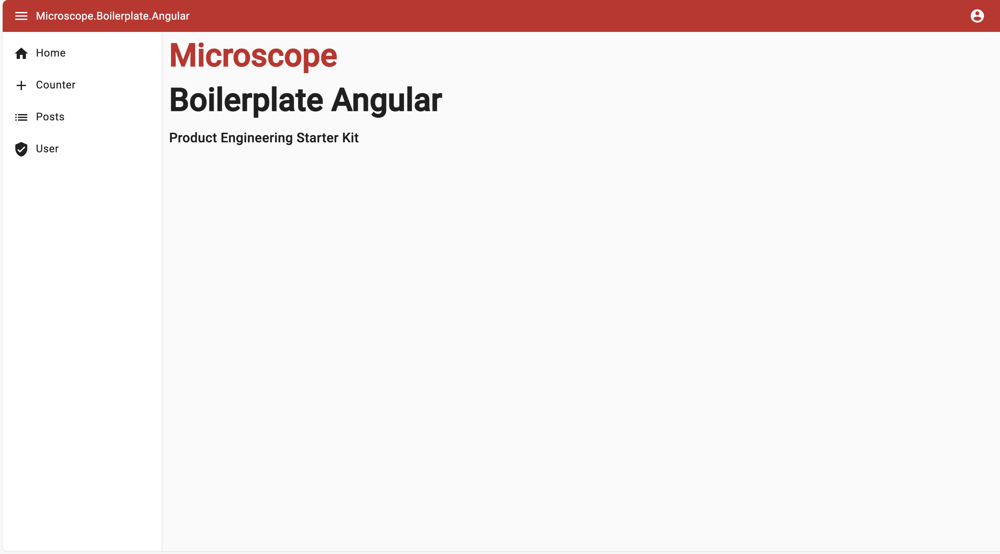

# Angular


> The web development framework for building the future

- [Web site](https://angular.io/)
- [Github](https://github.com/angular/angular)



## Features

## Material UI
* Add material UI design system
    * color primary by techno
    * layout with app bar & collapsable sidemenu to rail

> 💡 Easy intergration using ["@angular/material"](https://material.angular.io/) package

```html
<mat-toolbar color="primary">
  <mat-icon style="cursor: pointer;" (click)="toggle()" aria-hidden="false" aria-label="Example home icon" fontIcon="menu"></mat-icon>
  <span style="margin-left: 10px; font-weight: normal; font-size: medium;">Microscope.Boilerplate.Angular</span>
  <span class="spacer"></span>
  
  <button *ngIf="!isAuthenticated" mat-icon-button (click)="login()">
    <mat-icon>account_circle</mat-icon>
  </button>

  <button *ngIf="isAuthenticated" mat-button [matMenuTriggerFor]="menu">AD</button>
  <mat-menu #menu="matMenu">
    <button mat-menu-item (click)="goToAccount()">Account</button>
    <button mat-menu-item (click)="logout()">Logout</button>
  </mat-menu>

</mat-toolbar>

<mat-sidenav-container class="sidenav-container">
  <mat-sidenav class="sidenav" mode="side" [(opened)]="opened" >
    <mat-nav-list>
      <mat-list-item routerLink="/" routerLinkActive="active"><mat-icon class="v-align" fontIcon="home"></mat-icon><span>Home</span></mat-list-item>
      <mat-list-item routerLink="/counter" routerLinkActive="active"><mat-icon class="v-align" fontIcon="add"></mat-icon><span>Counter</span></mat-list-item>
      <mat-list-item routerLink="/posts" routerLinkActive="active"><mat-icon class="v-align" fontIcon="list"></mat-icon><span>Posts</span></mat-list-item>
      <mat-list-item routerLink="/user" routerLinkActive="active"><mat-icon class="v-align" fontIcon="verified_user"></mat-icon><span>User</span></mat-list-item>
    </mat-nav-list>
  </mat-sidenav>
  <mat-sidenav-content class="sidenav-content">
    <router-outlet></router-outlet>
  </mat-sidenav-content>
</mat-sidenav-container>
```

```js
export class AppComponent implements OnInit {
    public opened: boolean = true;
    // ..
    toggle() {
        this.opened = !this.opened;
    }
    // ..
}
```

## Custom endpoint

> 💡 Expose custom server endpoint to "/version" using a express API endpoint
    
```js
server.get('/version', (req, res) => {
    res.json({ version: '1.0.0' })
})
```

## Server side rendering
* Expose frontend web application with SSR
    * pre-rendering page with data
    * fallback into interactive UI

> 💡 Let angular universal handle the magic : 

**server.ts**
```js
  import { CommonEngine } from '@angular/ssr';

  // All regular routes use the Angular engine
  server.get('*', (req, res, next) => {
    const { protocol, originalUrl, baseUrl, headers } = req;

    commonEngine
      .render({
        bootstrap,
        documentFilePath: indexHtml,
        url: `${protocol}://${headers.host}${originalUrl}`,
        publicPath: browserDistFolder,
        providers: [{ provide: APP_BASE_HREF, useValue: baseUrl }],
      })
      .then((html) => res.send(html))
      .catch((err) => next(err));
  });
```

## OIDC & cookie authentication
* Handle OIDC auth over keycloak SSO
* Cookie & antiforgery token
* Login / Logout clean process

> 💡 Using angular-oauth2-oidc package for angular authentication

> 🚨 Authentication is handle here client side & secret token is in the browser ... to improve

**oidc.service.ts**
```js
import { AuthConfig, OAuthService } from 'angular-oauth2-oidc';

@Injectable({
    providedIn: 'root',
})
export class AuthService {
    private oAuthService = inject(OAuthService);
    private router = inject(Router);

    constructor() {
        this.initConfiguration();
    }

    initConfiguration() {
        const authConfig: AuthConfig = {
            issuer: 'http://localhost:8083/realms/microscope/',
            clientId: 'boilerplate',
            dummyClientSecret: 'JxaXjmKOd08cMpaKrThAObUzeOmyRiLN',
            scope: 'roles',
            responseType: 'code',
            redirectUri: 'http://localhost:4200/',
            strictDiscoveryDocumentValidation: false,
            skipIssuerCheck: true
        };

        this.oAuthService.configure(authConfig);
        this.oAuthService.setupAutomaticSilentRefresh();
        this.oAuthService.loadDiscoveryDocumentAndTryLogin();
    }

    login() {
        this.oAuthService.initLoginFlow();
    }
    // ..
}
```