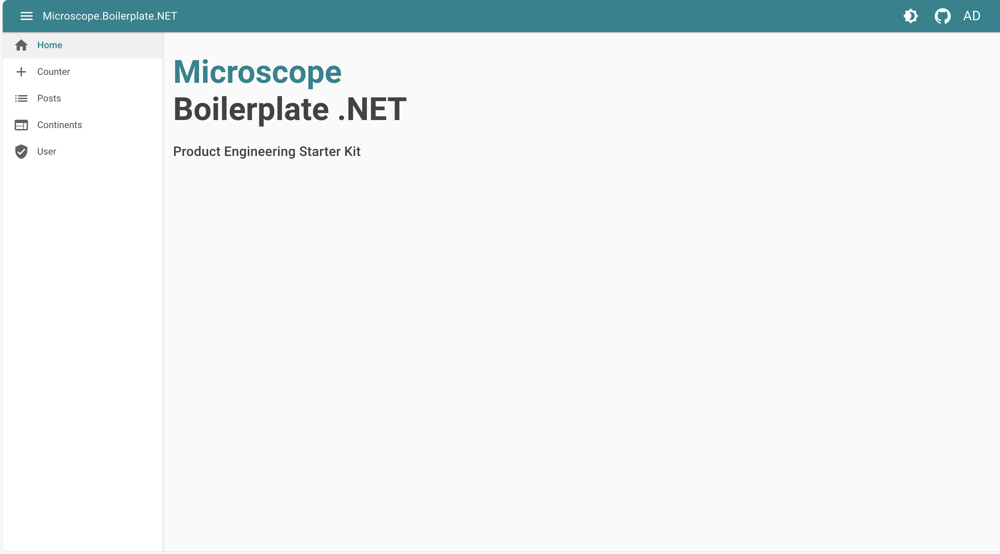

# Blazor


> Blazor is a .NET frontend web framework that supports both server-side rendering and client interactivity in a single programming model

- [Web site](https://dotnet.microsoft.com/en-us/apps/aspnet)
- [Github](https://github.com/dotnet/aspnetcore)



## Features

## Material UI
* Add material UI design system
    * Fluid implementation using [MudBlazor](https://mudblazor.com/). Excellent DX !
    * Layout with app bar & collapsable sidemenu to rail

> 💡 Easy intergration thx to mudblazor

```c#
<MudLayout>
    <MudAppBar Elevation="1" Color="Color.Primary" Dense="true">
        <MudIconButton Icon="@Icons.Material.Outlined.Menu" Color="Color.Inherit" Edge="Edge.Start" OnClick="((e) => ToggleDrawer())"/>
        
        <MudText>Microscope.Boilerplate.NET</MudText>
        @if (!HostingEnvironmentService.IsWebAssembly)
        {
            <MudProgressCircular Class="ml-2" Size="Size.Small" Color="Color.Inherit" Indeterminate="true"></MudProgressCircular>
        }
        <MudSpacer/>
        <MudIconButton Icon="@Icons.Material.Filled.Brightness4" Color="Color.Inherit" OnClick="ToggleTheme"/>
        <MudIconButton Href="https://github.com/bhtz/microscope-boilerplate" Target="_blank" Icon="@Icons.Custom.Brands.GitHub" Color="Color.Inherit"/>
        <LoginDisplay />
    </MudAppBar>
    
    <MudDrawer @bind-open="DrawerOpen" ClipMode="DrawerClipMode.Always" Elevation="2" Variant="DrawerVariant.Mini" MiniWidth="60px">
        <NavMenu/>
    </MudDrawer>
    
    <MudMainContent Class="mt-16 pa-4">
        @Body
    </MudMainContent>
</MudLayout>
```

```c#
    private bool DrawerOpen { get; set; } = true;

    public void ToggleDrawer()
    {
        DrawerOpen = !DrawerOpen;
    }
```

## Version endpoint

> 💡 Expose custom server endpoint to "/version" using a simple asp net minimal API endpoint
    
```c#
app.MapGet("/version", () => new { Version = "1.0.0" });
```

## Server side rendering
* Expose frontend web application with SSR
    * pre-rendering page with data
    * fallback into interactive UI

> 💡 Let blazor handle the magic : 

**Program.cs**
```c#
    app.MapRazorComponents<Host>()
        .AddInteractiveServerRenderMode()
        .AddInteractiveWebAssemblyRenderMode()
        .AddAdditionalAssemblies(typeof(_Imports).Assembly);
```

**Host.cs**
```c#
    <body>
        <Routes @rendermode="InteractiveAuto" />
        <script src="_framework/blazor.web.js"></script>
    </body>
```

## OIDC & cookie authentication
* Handle OIDC auth over keycloak SSO
* Cookie & antiforgery token
* Login / Logout clean process

> 💡 Simple OIDC asp net authentication

```c#
        services.AddAuthorization();
        services.AddAuthentication(options =>
            {
                options.DefaultScheme = CookieAuthenticationDefaults.AuthenticationScheme;
                options.DefaultChallengeScheme = OpenIdConnectDefaults.AuthenticationScheme;
            })
            .AddCookie(CookieAuthenticationDefaults.AuthenticationScheme)
            .AddOpenIdConnect(OpenIdConnectDefaults.AuthenticationScheme, options =>
            {
                options.Authority = oidcAuthenticationOptions.Authority;
                options.ClientId = oidcAuthenticationOptions.ClientId;
                options.ClientSecret = oidcAuthenticationOptions.ClientSecret;

                options.SignInScheme = CookieAuthenticationDefaults.AuthenticationScheme;
                options.ResponseType = OpenIdConnectResponseType.Code;

                options.RequireHttpsMetadata = false;
                options.SaveTokens = true;
                options.AuthenticationMethod = OpenIdConnectRedirectBehavior.RedirectGet;
                options.TokenValidationParameters = new TokenValidationParameters
                {
                    NameClaimType = oidcAuthenticationOptions.NameClaimType,
                    RoleClaimType = oidcAuthenticationOptions.RoleClaimType
                };

                foreach (var item in oidcAuthenticationOptions.Scopes)
                {
                    options.Scope.Add(item);
                }
            });
```

## Proxying API
* Proxying downsteam REST API
    * Proxying jsonplaceholder "todos" API with route "/api/todos"
    * [https://jsonplaceholder.typicode.com/](https://jsonplaceholder.typicode.com/)

> 💡 Using [YARP](https://microsoft.github.io/reverse-proxy/)

```c#
services
    .AddReverseProxy()
    .LoadFromConfig(configuration.GetSection("ReverseProxy"));
```

```json
  "ReverseProxy": {
    "Routes": {
      "post-service" : {
        "ClusterId": "post-service",
        "Match": {
          "Path": "/api/todos/{**catch-all}"
        },
        "Transforms": [
          {
            "PathRemovePrefix": "/api"
          }
        ]
      }
    },
    "Clusters": {
      "post-service": {
        "Destinations": {
          "post-service": {
            "Address": "https://jsonplaceholder.typicode.com"
          }
        }
      }
    }
  }
```

## GraphQL gateway
* Gateway GraphQL over downstream subgraph
    * Gateway over "countries" graph trevorblades
    * [https://countries.trevorblades.com/](https://countries.trevorblades.com/)

> 💡 Using Hotchocolate GraphQL gateway

**GraphQL configuration**
```c#
var builder = services.AddGraphQLServer();

foreach (var scalar in gatewayOptions.Scalars)
{
    builder.AddType(new AnyType(scalar));
}

foreach (var schema in gatewayOptions.Schemas)
{
    services
        .AddHttpClient(schema.Name, c => c.BaseAddress = new Uri(schema.Url))
        .AddHttpMessageHandler<BffAuthenticationHeaderHandler>();

    builder.AddRemoteSchema(schema.Name);

    var subgraph = services.AddGraphQL(schema.Name);
    foreach (var scalar in gatewayOptions.Scalars)
    {
        subgraph.AddType(new AnyType(scalar));
    }
}

builder.AddTypeExtensionsFromFile("./stitching.graphql");
```
**appsettings.development.json**
```json
  "GraphQLGateway": {
    "Scalars" : ["date", "timestamptz", "uuid"],
    "Schemas": [
      {
        "Name": "Countries",
        "Url": "https://countries.trevorblades.com/"
      }
    ]
  },
```

## Light / Dark theme
* Theme switcher implementation

> 💡 Using MudBlazor "MudThemingProvider"

**Defining theme**
```c#
public static MudTheme DarkTheme = new MudTheme()
{
    Palette = new Palette()
    {
        Black = "#27272f",
        Background = "#32333d",
        BackgroundGrey = "#27272f",
        Primary = Colors.Cyan.Darken3,
        Surface = "#373740",
        DrawerBackground = "#27272f",
        DrawerText = "rgba(255,255,255, 0.50)",
        AppbarBackground = "#27272f",
        AppbarText = "rgba(255,255,255, 0.70)",
        TextPrimary = "rgba(255,255,255, 0.70)",
        TextSecondary = "rgba(255,255,255, 0.50)",
        ActionDefault = "#ffffff",
        ActionDisabled = "rgba(255,255,255, 0.26)",
        ActionDisabledBackground = "rgba(255,255,255, 0.12)",
        DrawerIcon = "rgba(255,255,255, 0.50)"
    }
};
```

**Apply theme**
```c#
<MudThemingProvider Theme="_currentTheme" />
```

## I18N
* I18N switcher : FR & EN

> 💡 Using resources files & Localization